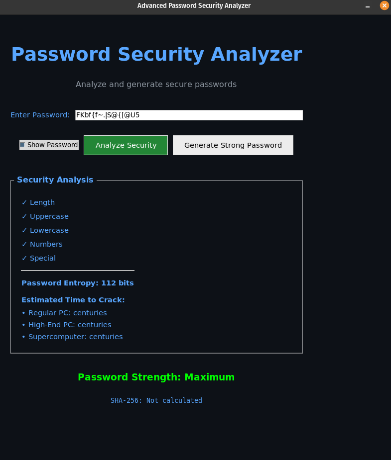
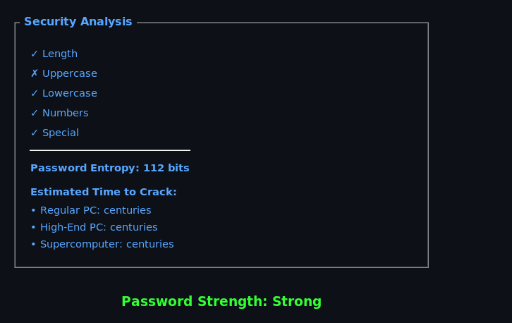

# Password Strength Checker


## 📌 Overview
Welcome to the **Advanced Password Security Analyzer**! This is a powerful and modern tool designed to help you analyze and generate secure passwords. With advanced features like security analysis, entropy calculation, and cracking time estimates, this tool is an essential utility for anyone who wants to ensure their passwords are as secure as possible.

Whether you're a developer, security enthusiast, or just someone who cares about online privacy, this tool can help you build stronger passwords and better protect your online accounts.

## 🎨 Features

- **Real-time Password Analysis**: 
    - Assess the strength of your password by checking various security criteria like length, uppercase, lowercase, numbers, and special characters.
    - Get an immediate visual feedback on whether your password is strong enough or needs improvement.

- **Entropy Calculation**:
    - The tool calculates the **entropy** of your password, which is a measure of its randomness and strength. The higher the entropy, the harder it is to crack.

- **Password Cracking Time Estimates**:
    - Using the latest technology, the tool estimates how long it would take for different devices (Regular PC, High-End PC, and Supercomputers) to crack your password.
    - Get a personalized breakdown of **seconds**, **minutes**, **hours**, **days**, or **years** it would take to crack your password.

- **Password Generator**:
    - If you're struggling to create a strong password, the tool can **generate** a secure password for you on the spot. Just click "Generate Strong Password," and you're ready to go!

- **Customizable Options**:
    - Choose your preferred password length (default is 16 characters).
    - Toggle password visibility with a "Show Password" option to view your password as you type it.

- **Beautiful and Modern UI**:
    - Built with **Tkinter**, this tool features a sleek and modern dark theme with GitHub-inspired colors.
    - User-friendly interface with neatly organized sections for input and output.

## 📊 How It Works

1. **Enter Your Password**:
    - Input your password into the text field and press the "Analyze Security" button.

2. **View the Results**:
    - Immediately receive detailed analysis:
        - Password criteria checks (length, complexity, character types).
        - Password entropy (randomness measure).
        - Cracking time estimates based on different devices.
        - Visual feedback of the password's strength.

3. **Generate a Secure Password**:
    - If your current password isn't strong enough, click "Generate Strong Password" to automatically generate a secure password for you.

4. **Enhanced Cracking Time Estimation**:
    - The tool will calculate the **estimated time** to crack the password based on the processing power of various devices, from regular PCs to supercomputers.

## 🛠️ Installation

To run the Password Strength Checker on your local machine, follow these steps:

1. **Clone the repository**:

    ```bash
    git clone https://github.com/HexSec/Password-Strength-Checker.git
    cd Password-Strength-Checker
    ```

2. **Install Tkinter (if not already installed)**:
    - Tkinter is the GUI toolkit used for this project. It usually comes pre-installed with Python. If you don't have it, install it via:

    ```bash
    pip install tk
    ```

3. **Run the Application**:
    - Once everything is set up, simply run:

    ```bash
    python password_strength_checker.py
    ```

4. **Enjoy**:
    - Open the app, input your passwords, and analyze them instantly!

## 🖼️ Screenshots

### Password Analyzer


### Generated Secure Password


### Security Results Display



## 🔧 Future Features (Coming Soon)

- **Password Strength Scoring**: Based on best practices and industry standards, this will assign a numeric score to the password, making it easier to gauge how secure it is.
  
- **Password Blacklist Check**: Verify if the password has been compromised in known data breaches by checking it against a large database of leaked passwords.
  
- **Password History Tracking**: Track the passwords you've analyzed and see their strength evolution over time.

- **Password Suggestions**: Get personalized suggestions based on the analysis of your password, including recommended improvements for better security.

- **Brute Force Simulation**: Simulate an actual brute force attack and measure the real-time cracking time against your password.

- **Support for Multiple Languages**: The interface will support multiple languages, so users across the globe can benefit from it.

## 📜 License

This project is licensed under the MIT License - see the [LICENSE](LICENSE) file for details.

## 🤝 Contributing

We welcome contributions from the community! If you'd like to contribute to this project, please follow these steps:

1. Fork this repository.
2. Create a new branch (`git checkout -b feature-branch`).
3. Commit your changes (`git commit -am 'Add new feature'`).
4. Push to the branch (`git push origin feature-branch`).
5. Open a pull request.

Feel free to open issues or submit feature requests if you have any suggestions!

## 🔗 Connect

- **GitHub**: [@HexSec](https://github.com/HexSec)


